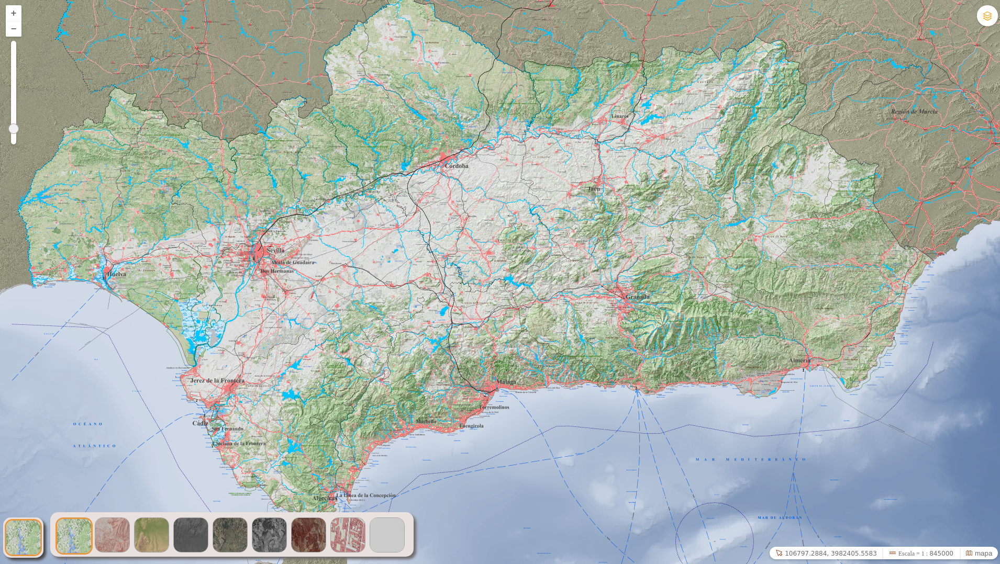

# SimpleBaseLayerSelector


[](https://github.com/sigcorporativo-ja/Mapea4-dev-webpack)

## Descripción

 Plugin de [Mapea](https://github.com/sigcorporativo-ja/Mapea4) Plugin para seleccionar Capas Base.

 En función de la configuración suministrada al plugin, si el mapa posee el control layerSwitcher, se mostraran u ocultaran las capas base del mapa. 

 Este plugin soporta tanto el uso de Layers como de WMC.
 




Previamente a la definición de los parámetros de configuración del plugin los layers a cargar o los WMC definido y cargado en Mapea.

En la [Wiki de Mapea](https://github.com/sigcorporativo-ja/Mapea4/wiki/Capas) viene detallada cada una de las definiciones de los diferentes tipos de Layers

Para el correcto funcionamiento del plugin es necesario pasarle en su constructor un objeto **json** con los parámetros esperados.
### Parámetros del plugin


- ### Definición Layers de Mapea ###

Antes de generar la configuración del plugin es necesario tener definidos los layers  o WMC que usará el mapa.


- ### Ejemplo SimpleBaseLayerSelector constructor con parámetros ###

```javascript
const config ={displayBaseLayersInLayerSwitcher: true}

const mp = new Simplebaselayerselector(config);
```

- ### Ejemplo SimpleBaseLayerSelector constructor sin parámetros ###
```javascript


const mp = new Simplebaselayerselector();

```
## Parámetros del Constructor

- **displayBaseLayersInLayerSwitcher [boolean]:**  Solo admite valores _True_ o _False_ .En caso de que se haya cargado el control LayerSwitcher. Si el valor es  ___True___  los BaseLayers se muestran en el LayerSwitcher si es ___False___ no mostrarán. 


## Recursos y configuración

- js: simplebaselayerselector.ol.min.js
- css: simplebaselayerselector.min.css

```javascript

//DEFINICION DE LAYERS
const ortofoto2016_color = new M.layer.WMS({
  url: 'http://www.ideandalucia.es/wms/ortofoto2016?',
  name: 'ortofotografia_2016_rgb',
  legend: 'Ortofotografía Color 0,5 metros/pixel (Año 2016)',
  transparent: false,
  tiled: true
}, {
  styles: 'default'
})

ortofoto2016_color.setLegendURL('https://www.ideandalucia.es/visor/leyendas/ortofoto2016_color.png')

const ortofoto2016_pancromatica = new M.layer.WMS({
  url: 'http://www.ideandalucia.es/wms/ortofoto2016?',
  name: 'ortofotografia_2016_pancromatico',
  legend: 'Ortofotografía Pancromática 0,5 metros/pixel (Año 2016)',
  transparent: false,
  tiled: true
}, {
  styles: 'default'
})

ortofoto2016_pancromatica.setLegendURL('https://www.ideandalucia.es/visor/leyendas/ortofoto2016_pancromatico.png');

const ortofoto2016_infrarrojo = new M.layer.WMS({
  url: 'http://www.ideandalucia.es/wms/ortofoto2016?',
  name: 'ortofotografia_2016_infrarrojo',
  legend: 'Ortofotografía Infrarrojo 0,5 metros/pixel (Año 2016)',
  transparent: false,
  tiled: true
}, {
  styles: 'default'
})

ortofoto2016_infrarrojo.setLegendURL('https://www.ideandalucia.es/visor/leyendas/ortofoto2016_infrarrojo.png');


const mdt_siose2013 = new M.layer.WMS({
  url: 'https://www.ideandalucia.es/wms/siose_2013?',
  name: 'sombreado_siose_2013',
  legend: 'Siose + MDT 2013',
  transparent: false,
  tiled: true
}, {
  styles: 'default'
})

mdt_siose2013.setLegendURL('https://www.ideandalucia.es/visor/leyendas/siose_2013.png');

const mdt_2016 = new M.layer.WMS({
  url: 'https://www.ideandalucia.es/wms/mdt_2016?',
  name: 'sombreado_orografico_2016,modelo_digital_terreno_2016_color',
  legend: 'MDT 2016',
  transparent: false,
  tiled: true
}, {
  styles: 'default'
})

mdt_2016.setLegendURL('https://www.ideandalucia.es/visor/leyendas/mdt_2016_tintas_hipsometricas.png');

const CDAU_Base = new M.layer.WMS({
  url: 'https://www.callejerodeandalucia.es/servicios/base/wms?',
  name: 'CDAU_base',
  legend: 'Base Cartográfica Callejero Digital de Andalucía',
  transparent: false,
  tiled: true
})

CDAU_Base.setLegendURL('https://www.ideandalucia.es/visor/leyendas/cdau_base.png');

const MapaAndalucia = new M.layer.WMS({
  url: 'https://www.ideandalucia.es/services/andalucia/wms?',
  name: '00_Mapa_Andalucia',
  legend: 'Mapa Topográfico de Andalucía',
  transparent: false,
  tiled: true
})


// DEFINICION CONFIGURACIÓN PLUGIN

const map = M.map({
  container: 'mapjs',
  layers: [ortofoto2016_color,
    ortofoto2016_pancromatica,
    ortofoto2016_infrarrojo,
    mdt_siose2013,
    mdt_2016,
    CDAU_Base,
    MapaAndalucia],
  maxExtent: [100401, 3987100, 621273, 4288700],
  projection: 'EPSG:25830*m',
});

map.addControls(['ScaleLine', 'Scale', 'Mouse', 'panzoombar', 'layerSwitcher']);

const config ={displayBaseLayersInLayerSwitcher: false}

const mp = new Simplebaselayerselector(config);

map.addPlugin(mp);


```

## Video Demo

Para comprobar el funcionamiento de este plugin se puede descargar este [Video](https://github.com/emiliopardo/simplebaselayerselector/blob/master/docs/video/simpleBaseLayerSelector.webm?raw=true). El cual contempla la configuración y carga del plugin.